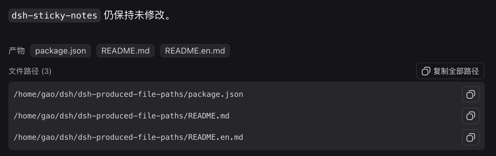

# dsh-produced-file-paths

[中文](README.md)

An independent DSH Web plugin that displays the **absolute paths** of files produced or modified during the current turn and makes those paths easy to copy.

## Why is this plugin needed?

DSH's remote Web interface shows files created or modified during a turn as clickable file items. However, those items are implemented as JavaScript buttons rather than ordinary links with an `href`. This creates several practical problems in remote Web deployments:

- There is no normal “Copy link address” browser action;
- The complete absolute path is not directly visible on the page;
- The remote Web Host often has no desktop application available, so clicking a file item may not open anything;
- Users still need to copy the path into SSH, a terminal, an editor, or another tool.

This plugin does not try to turn a Host filesystem path into a browser URL, and it does not add a file-download service. Instead, it reuses DSH's own produced-file list, displays the corresponding absolute paths, and provides copy controls. The original DSH file-opening behavior remains unchanged, while remote Web users gain a simple way to see and copy the paths they need.

## Screenshot

The following screenshot shows the plugin working in the DSH remote Web interface:



## Features

- Displays absolute paths below DSH's built-in produced-files row;
- Copies one file path at a time;
- Copies all produced paths, one per line;
- Keeps the path text selectable for ordinary text copying;
- Reads DSH's published produced-file list without modifying files;
- Does not add a file-download endpoint;
- Does not modify `dsh-sticky-notes`.

## Compatibility

- Supports DSH `0.1.0-rc.6`, `0.1.0-rc.8`, `0.1.1-rc.2`, `0.1.2-alpha.2`, and later versions.
- Zero external runtime dependencies; does not depend on the deprecated `dsh-client-runtime`.
- Injects via DSH standard slot `conversation.chat.turnTail` to coexist with built-in deliverables.

## Installation

Install it directly from GitHub with the DSH plugin manager:

```bash
dsh plugin --profile web add github:flyhigao/dsh-produced-file-paths
```

After installation, restart `dsh web` and hard-refresh the remote Web page (`Ctrl+Shift+R`).

### Local development

To develop from a local checkout instead, use a local directory source:

```bash
dsh plugin --profile web add file:/path/to/dsh-produced-file-paths
```

Refresh the page after client-bundle changes. Restart `dsh web` after changing the host entry or bundle composition.

## Path semantics and security boundary

The plugin copies an **absolute filesystem path** under the current DSH Session workspace. It does not create a browser URL or a `file://` link. For example:

```text
/home/gao/dsh/reports/summary.md
```

Paths come from DSH's published produced-file data, with relative paths resolved against the current Session workspace. The plugin only reads and displays those paths; it does not accept user-supplied paths, scan the workspace, or read file contents.

Copying a path therefore does not grant any new file access. Whether the path can be used remains determined by SSH, a terminal, an editor, or another tool where the path is pasted.

## Troubleshooting after an upgrade

If the copy control is not visible after installation, check the following in order:

1. Make sure the plugin was installed into the Web profile:

   ```bash
   dsh plugin --profile web add github:flyhigao/dsh-produced-file-paths
   ```

2. Restart `dsh web`, because `cordis.patch.yml` and the browser plugin manifest are composed at startup.
3. Hard-refresh the browser page (`Ctrl+Shift+R`) to discard an old client-bundle cache.
4. Confirm that DSH's built-in produced-files row appears first. This plugin only renders paths that DSH has already identified; it does not guess files from prose or scan the workspace.
5. When developing from a local checkout, remove the stale profile copy and reinstall it:

   ```bash
   cd ~/.dsh/profiles/web
   rm -rf node_modules/dsh-produced-file-paths
   pnpm install
   ```

A remote Web Host without a desktop file opener can still use path copying; the feature only needs the browser clipboard and the current Session's path data.

## Development and release checks

This is a small hand-maintained plugin and does not require an additional build tool. The browser bundle is `client/client.js`, and the host entry is `lib/index.js`.

Before committing or publishing, run:

```bash
node --check client/client.js
node --check lib/index.js
npm pack --dry-run
tar -tzf dsh-produced-file-paths-*.tgz
```

The release package must contain `lib/`, `lib/types/`, `client/`, `assets/`, `cordis.patch.yml`, and both README files. The `dsh.bundle` declaration in `package.json` and the root `cordis.patch.yml` are the composition entry required by the DSH plugin manager and the plugin market.
