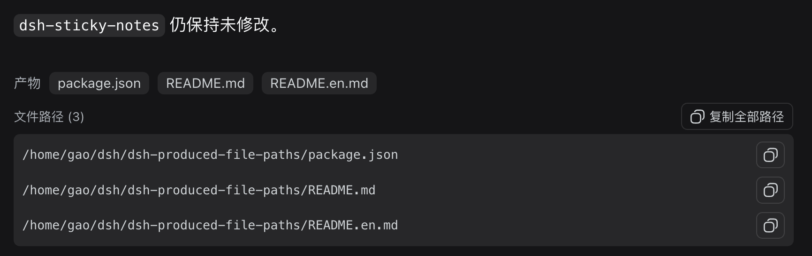

# dsh-produced-file-paths

[English](README.en.md)

独立的 DSH Web 插件：在 DSH 内置的“产物”文件行下面显示本轮生成/修改文件的**绝对路径**，并提供：

- 单个文件路径复制；
- 一键复制全部文件路径（每行一个）；
- 路径文本可直接选中复制。

## 为什么需要这个插件？

DSH 的远程 Web 界面会把本轮生成或修改的文件显示为可点击的文件项，但这些文件项本质上是由前端 JavaScript 处理的按钮，并不是带有 `href` 的普通链接。因此在远程访问时会遇到几个实际问题：

- 无法右键复制链接地址；
- 页面上不容易直接看到文件的完整绝对路径；
- 远程 Web 所在的 Host 通常没有可用的桌面程序，点击文件项不一定能打开文件；
- 用户需要把文件路径复制到 SSH、终端、编辑器或其他工具中继续处理。

这个插件不试图把远程 Host 文件伪装成浏览器 URL，也不新增文件下载服务。它直接复用 DSH 已经识别出的本轮产物文件列表，在界面中显示对应的绝对路径，并提供复制按钮。这样既保留 DSH 原有的文件打开行为，也为远程 Web 场景补上“看得到、复制得到文件路径”的能力。

## 界面效果

下面是插件在 DSH 远程 Web 界面中的实际效果：



## 功能

- 在 DSH 内置“产物”文件行下方显示本轮生成/修改文件的绝对路径；
- 单个文件路径复制；
- 一键复制全部文件路径（每行一个）；
- 路径文本可直接选中复制；
- 只读取 DSH 已经识别出的 produced-file 列表，不修改文件；
- 不增加文件下载接口；
- 不修改 `dsh-sticky-notes`。

## 安装

本地 profile 使用：

```json
{
  "dependencies": {
    "dsh-produced-file-paths": "file:/home/gao/dsh/dsh-produced-file-paths"
  },
  "dsh": {
    "profile": {
      "bundles": [
        "@deepseek-ai/dsh-base",
        "@deepseek-ai/dsh-web-app",
        "dshmarket",
        "dsh-sticky-notes",
        "dsh-produced-file-paths"
      ]
    }
  }
}
```

然后在 Web profile 目录执行 `pnpm install` 并重启 DSH。
